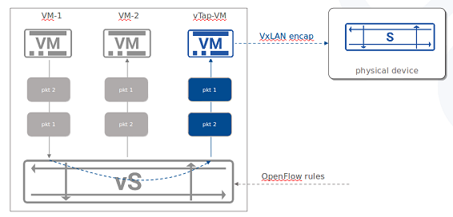

English | [简体中文](./README.md)

<h1 align="center">Tapplet</h1>

## Introduction
The Tapplet platform consists of a series of plugins based on [VPP](https://github.com/FDio/vpp).It works with VPP to provide basic functions like ACL , GRE/VxLAN/ERSPAN encapsulation and load balance to collect virtual network traffic.

For more information on Tapplet and VPP , please visit the [Asterfusion](https://asterfusion.com) and
[FD.io](http://fd.io/) website pages.


## System requirement
- Platform : x86_64 (Intel Nehalem or later ; sse,sse2,ssse3,sse4_1 and sse4_2 are needed)
- Operating System :  Ubuntu 16.04+
- CPU: 2 cores at least
- Memory : 2G +
- Disk :  10GB +
- vNIC Model : Virtio

## Web Controller
Web Controller developped for Tapplet are available now. See [Tapplet-Web](https://github.com/asterfusion/Tapplet-Web) for more information.


## Quick-start
### Build Tapplet
First, /bin/sh must be linked to bash. On Ubuntu, you can replace dash with bash by using the following command:
    
    sudo dpkg-reconfigure dash

To build VPP and Tapplet deb packages , simply run the build script. This should
be performed as a non-privileged user with `sudo` access from the project basic directory:

    ./release/build.sh

Vpp-dev and vpp-ext-deps will be installed when building Tapplet. You can uninstall them later with 'sudo dpkg -P vpp-dev vpp-ext-deps'.

### Install Tapplet
If the build script finishes normally, you will get some debs under directory ./release/build/install-native. Then you can install them with 'sudo dpkg -i *.deb'. Installing debug info debs (tapplet-dbg , vpp-dbg) is not necessary but recommended.


### Use Case : Collect virtual network traffic


#### 1. create a VM with Virtio ports and install Tapplet & Tapplet-Web on it

#### 2. check VM ports
```
$ sudo virsh domiflist <domain>
Interface  Type       Source     Model       MAC
-------------------------------------------------------
vnet9      bridge     br0        rtl8139     52:54:00:34:7f:c1
vnet10     bridge     br-int     virtio      52:54:00:57:6c:b9
vnet11     bridge     br-out     virtio      52:54:00:96:87:4a
```

#### 3. add physical NIC to 'br-out'

```
$ sudo ovs-vsctl add-port br-out enp130s0f0
```


#### 4. create Open vSwitch rules like this:

```
$ sudo ovs-vsctl -- set Bridge br-int mirrors=@m -- --id=@p get port vnet10 -- --id=@m create mirror name=m0 select-all=true output-port=@p ## mirrors all network traffic in br-int to Tapplet port 1

$ sudo ovs-ofctl add-flow br-out "in_port=vnet11 actions=output:enp130s0f0" ## transport all network traffic from Tapplet port 2 to physical NIC
```

#### 5. create rules and actions on Tapplet Web pages

- create ingress group


- create egress group


- add vxlan config


- add acl rule


#### 6. check port statistics


## Contributing

Any type of contribution is welcome, here are some examples of how you may contribute to this project:

- Use Ant Design Pro in your daily work.
- Submit [issues](https://github.com/asterfusion/Tapplet/issues) to report bugs or ask questions.
- Propose [pull requests](https://github.com/asterfusion/Tapplet/pulls) to improve our code.
