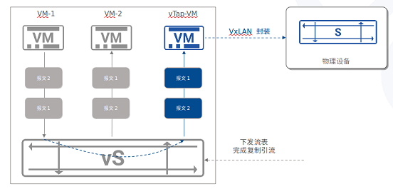
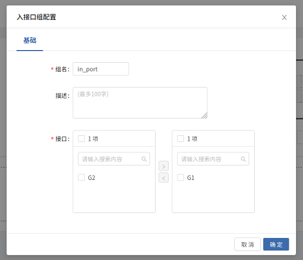
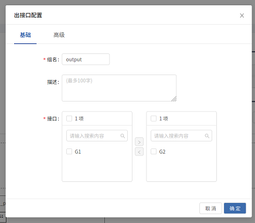
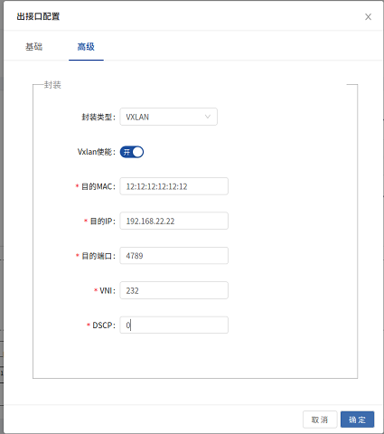
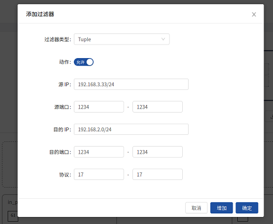
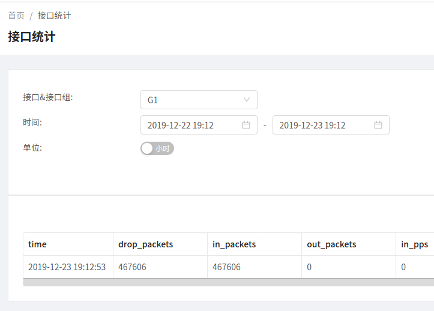

[English](./README.en.md)  |  简体中文  

<h1 align="center">Tapplet</h1>

## 简介
Tapplet 是基于 [VPP](https://github.com/FDio/vpp) 开发的一系列插件。它和VPP一起使用，提供一些基本的流量采集功能，比如ACL，GRE/VxLAN/ERSPAN封装及负载均衡

更多信息请访问 [VPP官网](http://fd.io/) 及 [Asterfusion官网](https://asterfusion.com)

## 系统需求
- 平台 : x86_64 (Intel Nehalem 及以上架构，至少具备sse sse2 ssse3 sse4_1 sse4_2等特性)
- 操作系统 :  Ubuntu 16.04+
- CPU: 至少2个核心
- 内存 : 2G +
- 磁盘 :  10GB +
- 虚拟网卡类型 : Virtio

## 管理页面
为Tapplet开发的管理页面可以从 [Tapplet-Web](https://github.com/asterfusion/Tapplet-Web) 获取。更多信息请参考该项目README

## 快速入门
### 编译 Tapplet
首先，默认shell 必须改为bash (/bin/sh)，Ubuntu 替换 dash 可以用下面的命令:
    
    sudo dpkg-reconfigure dash

进入根目录执行下面的脚本即可开始自动下载、编译 VPP 和 Tapplet 安装包(执行用户需要拥有 sudo 权限):

    ./release/build.sh

编译过程中会安装vpp-dev 和 vpp-ext-deps ， 编译完成后可以手动卸载:

    sudo dpkg -P vpp-dev vpp-ext-deps


### 安装 Tapplet
编译脚本执行成功后，可以在 ./release/build/install-native 下面找到 VPP 和 Tapplet 的安装包，直接通过'sudo dpkg -i *.deb'安装即可


### 使用案例：采集虚拟网络流量


#### 1. 建立一个新的虚拟机，添加对应的Virtio端口，安装 Tapplet 和 Tapplet-Web

#### 2. 检查虚拟机端口
```
$ sudo virsh domiflist <domain>
Interface  Type       Source     Model       MAC
-------------------------------------------------------
vnet9      bridge     br0        rtl8139     52:54:00:34:7f:c1
vnet10     bridge     br-int     virtio      52:54:00:57:6c:b9
vnet11     bridge     br-out     virtio      52:54:00:96:87:4a
```

#### 3. 添加物理网卡到 'br-out' 网桥

```
$ sudo ovs-vsctl add-port br-out enp130s0f0
```


#### 4. 添加 Open vSwitch 规则

```
$ sudo ovs-vsctl -- set Bridge br-int mirrors=@m -- --id=@p get port vnet10 -- --id=@m create mirror name=m0 select-all=true output-port=@p ## 镜像全部端口流量到Tapplet 端口1

$ sudo ovs-ofctl add-flow br-out "in_port=vnet11 actions=output:enp130s0f0"  ## Tapplet 端口2 流量直接转发到物理网卡
```

#### 5. 使用 Tapplet 管理页面创建相应规则

- 创建入接口组



- 创建出接口组



- 添加出接口配置



- 添加ACL规则



#### 6. 检查端口计数



## 参与贡献

我们非常欢迎你的贡献，你可以通过以下方式和我们一起共建 :smiley:：
- 通过 [Issue](https://github.com/asterfusion/Tapplet/issues) 报告 bug 或进行咨询。
- 提交 [Pull Request](https://github.com/asterfusion/Tapplet/pulls) 改进 Tapplet 的代码。